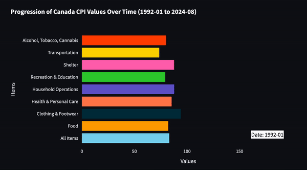
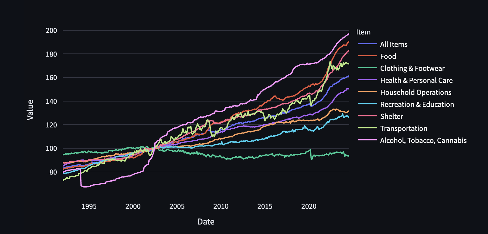
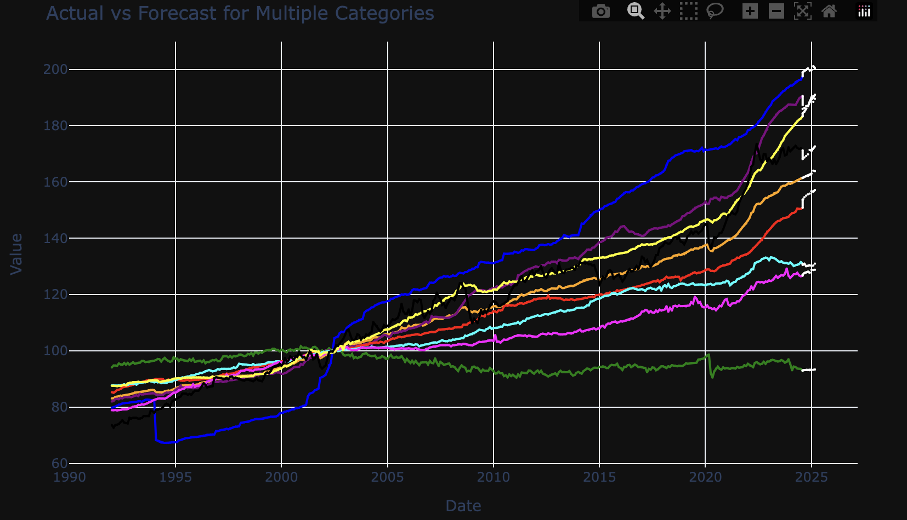
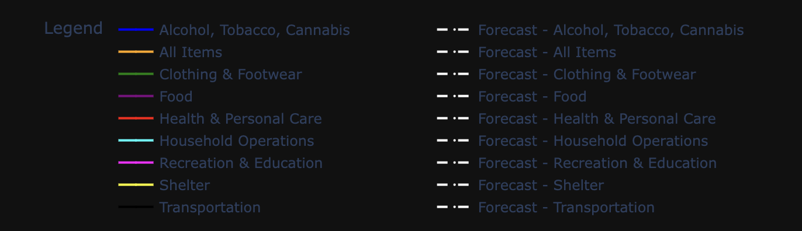
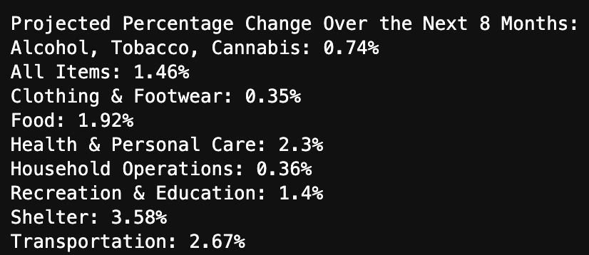

# Canada CPI Inflation Analysis and Prediction

Credits: [Farm Bureau](https://www.fb.org/market-intel/market-intel-inflation-and-the-banks)

Canada's economy is undergoing significant changes as it adapts to post-pandemic shifts in supply chains, consumer behavior, and market dynamics. Predicting key indicators like inflation through machine learning provides valuable insights into future trends, helping businesses, policymakers, and consumers make informed decisions. By using advanced forecasting techniques, we can anticipate price changes, optimize strategies, and address potential challenges, ensuring better financial planning and economic resilience in a rapidly evolving landscape.
***

## 🏁   Project Goals
▪️ Identify economic trends in Canada from 1992 to 2024.

▪️ Construct an ML model that predict **CPI** for the future so that businesses, policymakers, and consumers can make informed decisions.

***

## Initial Questions
▪️ Is there trend or seasonality in `All Item values` we can find?

▪️ Does CPI follow a specific pattern each month over the years?

▪️ Does `Food`, `Shelter`, `Household Operations`, `Clothing and footwear`, `health and personal care`, `transportation`,`Recreation, education and reading`,`Alcoholic beverages, tobacco products and recreational cannabis` have distinct trends or do they all follow the same pattern?

***

## Data Dictionary
**Variable** |    **Value**    | **Meaning**
---|---|---
*Year* | Datetime object | The year of the data source
*Month* | Integer ranging from 1-12 | The month of the data source
*All Items Value* | Float | All items CPI in Canada city average, seasonally adjusted
*Food* | Float | Food CPI in Canada city average, seasonally adjusted
*Shelter* | Float | Shelter CPI in Canada city average, seasonally adjusted
*Household operations, furnishings and equipment* | Float | Household operations, furnishings and equipment CPI in Canada city average, seasonally adjusted
*Clothing and footwear* | Float | Clothing and footwear CPI in Canada city average, seasonally adjusted
*Transportation* | Float | Transportation CPI in Canada city average, seasonally adjusted
*Health and personal care*| Float | Health and personal care CPI in Canada city average, seasonally adjusted
*Recreation, education and reading* | Float | Recreation, education and reading CPI in Canada city average, seasonally adjusted
*Alcoholic beverages, tobacco products and recreational cannabis* | Float | Alcoholic beverages, tobacco products and recreational cannabis CPI in Canada city average, seasonally adjusted

***

## 📊   Data Context
We have monthly data from 1992 to 2024 CPI for All Urban Consumers. 3 **datetime** objects and 9 **numerical** variables.

***

##  Project Plan / Process
####   1. Data Acquisition

- Data got from Statistics Canada

#### 2. Data Preparation

- Data Cleaning: Clean empty rows, convert data to multiple time series format. 
- Data Splitting: Using percentage-based method to split data into **train, validate, test**

####  3. Exploratory Analysis
- Ask questions to find trend or seasonality in `all_items_value`

- Resample by month and explore commonality in values over time

- Using visualizations to better understand the relationship between features

#### 4. Modeling Evaluation
- Using **Last Observed Value** to make prediction and calculate model's RMSE on validate dataset

- Using **Simple Average** to make prediction and calculate model's RMSE on validate dataset

- Using **Moving Average** to make prediction and calculate model's RMSE on validate dataset

- Using **Holt's Linear Trend** to make prediction

- Pick the model with lowest RMSE and evaluate on test dataset

- Further use LSTM to predict the future values as well

***

### Inference and Conclusion from Projected Percentage Change Over the Next 8 Months:
### Inference:
#### Shelter (3.58% Increase):

The most significant projected increase is seen in the shelter category, suggesting continued upward pressure on housing costs. This could be driven by factors such as increasing demand for housing, limited supply, or rising mortgage rates. It's critical to monitor the housing market as it will significantly impact household budgets.

#### Transportation (2.67% Increase):

Transportation is also expected to experience a substantial increase. Rising fuel costs or fluctuations in the automotive market (e.g., vehicle prices, maintenance costs) might contribute to this change. Given the impact of transportation on everyday life, this could lead to higher overall living costs.

#### Health & Personal Care (2.3% Increase):

This category's projected growth suggests increasing healthcare costs or higher prices for personal care items. Inflation in this area could be due to rising medical service fees or more expensive personal care products.

#### Food (1.92% Increase):

The food category shows a significant rise, indicating potential inflationary pressure in the cost of groceries. This could stem from supply chain disruptions, increased production costs, or shifts in global food markets. Rising food prices may contribute to overall inflation.

#### Recreation & Education (1.4% Increase):

The rise in recreation and education costs points to increased prices in leisure activities and educational services. This might reflect higher costs for entertainment, cultural events, or educational materials.

#### All Items (1.46% Increase):

The overall CPI forecast shows a modest increase of 1.46%, suggesting a general inflationary trend over the next 8 months. This indicates a consistent rise in the cost of living across multiple sectors.

#### Alcohol, Tobacco, and Cannabis (0.74% Increase):

The relatively smaller increase in alcohol, tobacco, and cannabis suggests moderate price stability in these areas. Government regulations, taxation, and controlled markets may help keep price volatility in check.

#### Clothing & Footwear (0.35% Increase) and Household Operations (0.36% Increase):

These categories exhibit the lowest projected inflation rates, indicating relatively stable prices for apparel and household services. This may reflect less immediate pressure from supply chain issues or consumer demand in these sectors.

## Conclusion:

- Overall Inflationary Trend: The forecasted CPI projections indicate a moderate inflationary trend across most categories, with the highest impacts expected in shelter, transportation, health care, and food. Rising prices in these essential categories could lead to increased financial pressure on households.

- Shelter and Transportation: With shelter and transportation showing significant price increases, it will be essential for policymakers and consumers to monitor these sectors closely. High housing and transportation costs can have ripple effects on the broader economy, especially impacting affordability for low- and middle-income families.

- Focus on Key Sectors: To mitigate the inflationary impact, it may be necessary to address the underlying causes of price increases, such as supply chain bottlenecks in food and fuel or market imbalances in housing.

- Potential Economic Adjustments: The projected inflationary pressures could trigger policy responses such as interest rate adjustments, subsidies for affected sectors, or targeted consumer protection measures to alleviate the cost burden on households.

In summary, the projections suggest inflationary trends will persist, with certain categories like shelter and transportation requiring close attention. Strategic economic planning may help to reduce inflationary pressures and stabilize costs for consumers over the coming months.

### Notebook:
[Link](notebook.ipynb)

### Credits: 
Statistics Canada Table 18-10-0006-01  Consumer Price Index, monthly, seasonally adjusted"
https://www150.statcan.gc.ca/t1/tbl1/en/tv.action?pid=1810000601
